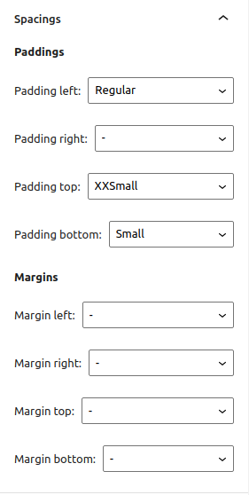
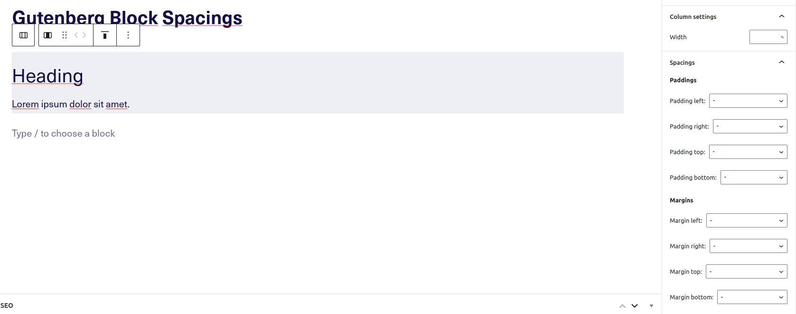
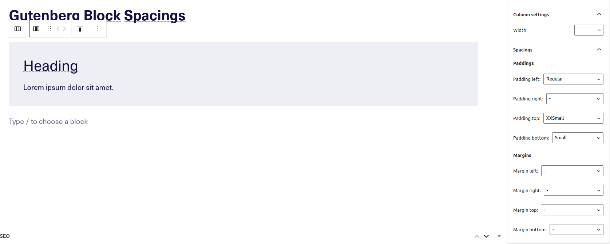

# Gutenberg Block Spacings

Wordpress Gutenberg add-on that adds spacings options to each block.

The plugin is strongly based on the fluid design approach.
Spacings are predefined in scss styles, if you want to change their values, add the appropriate values to the classes.

### Spacings

```
xxsmall: 	1rem;    	// 16px
xsmall: 	1.5rem;		// 24px
small: 		2rem;      	// 32px
regular: 	2.5rem;		// 40px
medium: 	3rem;     	// 48px
large: 		3.5rem;		// 56px
xlarge: 	4rem;     	// 64px
xxlarge: 	4.5rem;    	// 72px
none: 		0,      	// 0px
```

## How it works?

After selecting the appropriate value in select element, the plugin adds the appropriate class to the current block, as follows:

> Margin left: Small -> .u-margin-left-small

### How to modify values?

Add in your theme custom css styles for all spacings (paddings, margins and their directions): 

```
// .u-TYPE-DIRECTION-VALUE
// margin / padding
// top / left / bottom / right
// xxsmall / xsmall / small / regular / medium / large / xlarge / xxlarge / none

.u-margin-top-small {
	margin-top: 30px; // your custom value
}
```

## Screenshots 

How it looks like?



Usage - before


Usage - after


---

This project was bootstrapped with [Create Guten Block](https://github.com/ahmadawais/create-guten-block).

Below you will find some information on how to run scripts.

>You can find the most recent version of this guide [here](https://github.com/ahmadawais/create-guten-block).

## 👉  `npm start`
- Use to compile and run the block in development mode.
- Watches for any changes and reports back any errors in your code.

## 👉  `npm run build`
- Use to build production code for your block inside `dist` folder.
- Runs once and reports back the gzip file sizes of the produced code.

## 👉  `npm run eject`
- Use to eject your plugin out of `create-guten-block`.
- Provides all the configurations so you can customize the project as you want.
- It's a one-way street, `eject` and you have to maintain everything yourself.
- You don't normally have to `eject` a project because by ejecting you lose the connection with `create-guten-block` and from there onwards you have to update and maintain all the dependencies on your own.

---

###### Feel free to contact and say 👋 [Frontkom](https://frontkom.com/)
